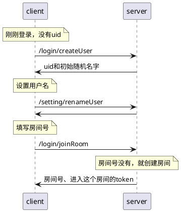
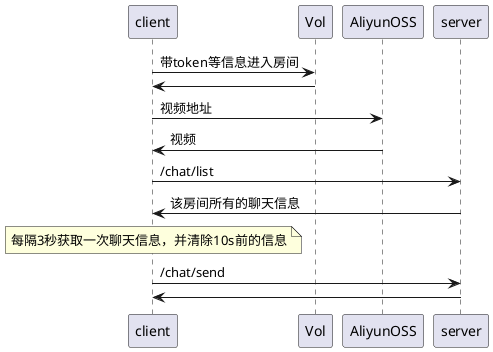

https://www.yuque.com/nullyuque/mkmaub/nhd91rc3nouom40n

## 简介
项目地址：[https://gitee.com/Feel_Again/android/tree/master/wct](https://gitee.com/Feel_Again/android/tree/master/wct) 或 [https://github.com/nullgit/android/tree/master/wct](https://github.com/nullgit/android/tree/master/wct)
安装包下载地址：[https://tmp-yunzen.oss-cn-shanghai.aliyuncs.com/%E7%8E%8B%E8%BF%90%E6%B3%BD-%E4%B8%80%E8%B5%B7%E6%9D%A5%E4%BE%83%E4%B8%96%E7%95%8C%E6%9D%AF.apk](https://tmp-yunzen.oss-cn-shanghai.aliyuncs.com/%E7%8E%8B%E8%BF%90%E6%B3%BD-%E4%B8%80%E8%B5%B7%E6%9D%A5%E4%BE%83%E4%B8%96%E7%95%8C%E6%9D%AF.apk)

使用的框架是Flutter，原因是相中了它跨平台的特点
> Flutter是谷歌公司开发的一款开源、免费的UI框架，可以让我们快速的在Android和iOS上构建高质量App。它最大的特点就是跨平台，以及高性能。目前 Flutter 已经支持 iOS、Android、Web、Windows、macOS、Linux等。

实现的基本功能：

- 用户登录
   - 输入房间号和密码后进入房间
- 音视频聊天
   - 支持同一房间内最多8人音视频聊天，每个人可选择是否开启摄像头、麦克风
- 文字聊天
   - 房间内的人可发送文本消息，并让其他人看到；实现了消息列表，展示房间内所有人发出的消息，支持滚动查看历史消息，收到新消息后自动在消息列表上展示
   - 全屏模式下，长时间没人聊天时，聊天列表消失
- 视频播放
   - 从手机里选择一个视频并播放，让房间内其他人可以看到；当开始播放视频时，摄像头停止采集，只推流本地视频❌
   - 进入房间后，直接有足球视频实时播放⭕
- 全屏模式
   - 沉浸式状态栏体验
## 展示
### 首页登录

- 获取拍摄照片和录制视频+录制音频的权限 

可以改进为进入房间前再获取权限

- 进入到“加入房间页”

首页本来想做成竖屏的，但是Flutter框架的横竖屏切换功能有bug，所以都是横屏的。

- 可以通过下面一排的按钮来选择进入房间前是否开视频等

- 首行展示了用户的头像和昵称，头像和昵称都可以更改。

输入房间号和密码后即可进入房间，密码默认就是房间号。。
目前1、2、3、4号房间都有频道~

### 进入房间

- 左边是视频播放频道和一排控制按钮，右边是视频或聊天，默认是视频卡片

如果用户关闭了远程视频，默认展示空白，可以优化为展示头像；远程视频下是用户id，优化为展示用户昵称。

- 点击聊天会展示历史聊天列表；点击“发出聊天”，输入聊天内容，确认后会发出聊天

发出聊天的Dialog在小屏幕上展示不佳，输入法会把输入框挤掉。。

聊天列表的uid也应该变为用户昵称，而且可以加些气泡等样式。
### 全屏模式

- 点击“全屏”进入全屏模式，此时系统状态栏和底栏隐藏；10s内的聊天记录会展示在左上角

消失的时候可以添加动画
点击左上角的返回按钮才会返回到刚刚全屏前的页面，按系统返回键会返回到主页。。
## 设计
### 服务端以及与客户端的交互
服务端使用的框架是SpringBoot，语言是Kotlin（主要）+Java（生成token的代码），使用的中间件是数据库MySQL。
MVC模式：

服务端提供的功能：

- 登录和进入房间
- 聊天
- 存储视频（阿里云）
- 实时音视频（火山引擎）

登录和进入房间：

进入房间后：

聊天服务端的一种更好的方案：客户端进入房间后，与服务端建立websocket；消息来后服务端通过websocket推送给客户端。
我在使用火山引擎的屏幕分享功能的时候遇到的错误:(，

所以直播功能我采用了其他的思路。视频的起始播放时间，根据当前系统时间计算而来。达成的效果是只要用户的时间是一致的，就能看到相同的画面。
### 页面
Flutter的写法类似HTML+CSS的组合，即结构和样式写在了一起；一个Widget就是一个组件

容易形成很多层的嵌套。。比如想要居中要用`Center`包裹Widget，鄙人更喜欢将样式作为设置项
所以拆成了很多方法：

使用了一个状态管理库GetX：

> GetX不仅有状态管理，还有路由管理、主题管理、网络请求、数据验证等功能，功能强大并且高性能

Flutter适用于：

- 需要跨端的、小型的App
- SDK支持Flutter

不然还需要写很多原生开发代码来适配，最后并不比直接原生开发省心省力。。
## 总结与展望
### 收获
尝试使用跨平台移动端框架Flutter和火山引擎搭建了一个简单的实时音视频+文字聊天+直播系统，在编写Flutter代码过程中从另一个视角体会客户端开发。
要点：

- 学习Dart语言和Flutter框架
- GetX状态管理、路由、Dialog等组件的使用
- logger打日志、vedio_player库播放视频、get_storage本地存储、camera调用摄像机、auto_orientation旋转屏幕、image_picker选取图片
- Kotlin写SpringBoot
### 展望
解决使用Flutter框架的问题：横竖屏切换、屏幕分享等
新功能：发送动画表情
优化页面：输入弹窗不被输入法挤掉、聊天列表添加气泡、状态变化添加动画等
发掘火山引擎的其他功能：美颜等
将代码打包应用于其他平台：IOS、**Web**、PC等（看起来Web端能通过浏览器屏蔽掉很多平台差异，而且火山引擎支持更好）

由于要写毕业论文且没多大用处就不做了。。

